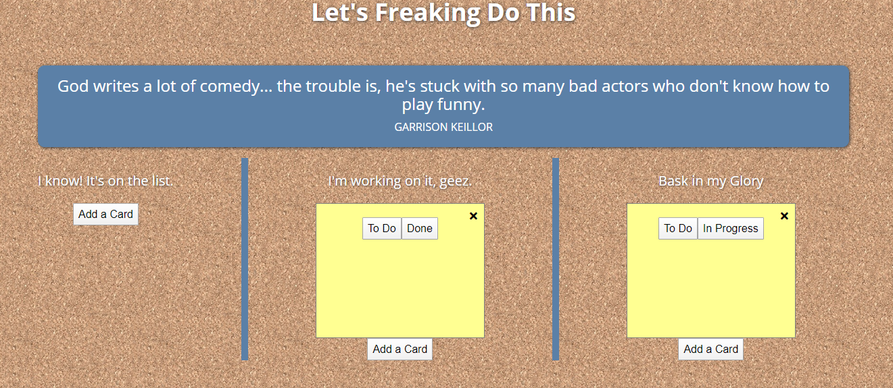
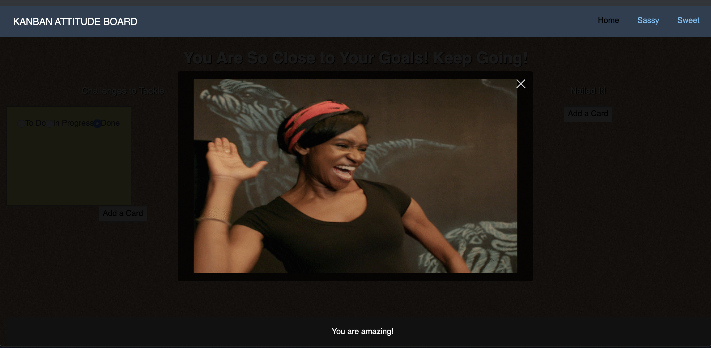

# Project One

## Description

This is our team's first project for UA's coding bootcamp. It is a virtual Kanban Board with two distinct "attitudes" to choose from depending on if you want sweet, encouraging messages or sarcatic, biting motivation. 

## Installation

To install this project all you need to do is download the repository and open index.html using your browser of choice. Alternatively, you could just go to the github page for this website.

## Usage

To use this project, choose your preffered "attitude" from the homepage. 

Then, crate new cards in each category depending on if you want to mark down a task as "To-Do", "In-Progress", or "Done". You may then use the buttons on the cards to move them to each different catogory or delete them. You may toggle between attitudes by using the links in the top right-hand corner.

When you mark a task done, a celabratory gif will pop up! Click anywhere to dismiss.

To modify this project, you will need to reference the documentation for Pure CSS for the base styling, jQuery for many of the script functions, the Quotes.rest API, and the GIPHY API. 

## Credits

Credit to Pure CSS, Quotes.rest, GIPHY, Subtle Patterns, and Font Awesome. 

## License

MIT License

Copyright (c) 2019 Angela Banks, Christine Camou, Jenna Miles, Kaylee Nelson

Permission is hereby granted, free of charge, to any person obtaining a copy
of this software and associated documentation files (the "Software"), to deal
in the Software without restriction, including without limitation the rights
to use, copy, modify, merge, publish, distribute, sublicense, and/or sell
copies of the Software, and to permit persons to whom the Software is
furnished to do so, subject to the following conditions:

The above copyright notice and this permission notice shall be included in all
copies or substantial portions of the Software.

THE SOFTWARE IS PROVIDED "AS IS", WITHOUT WARRANTY OF ANY KIND, EXPRESS OR
IMPLIED, INCLUDING BUT NOT LIMITED TO THE WARRANTIES OF MERCHANTABILITY,
FITNESS FOR A PARTICULAR PURPOSE AND NONINFRINGEMENT. IN NO EVENT SHALL THE
AUTHORS OR COPYRIGHT HOLDERS BE LIABLE FOR ANY CLAIM, DAMAGES OR OTHER
LIABILITY, WHETHER IN AN ACTION OF CONTRACT, TORT OR OTHERWISE, ARISING FROM,
OUT OF OR IN CONNECTION WITH THE SOFTWARE OR THE USE OR OTHER DEALINGS IN THE
SOFTWARE.